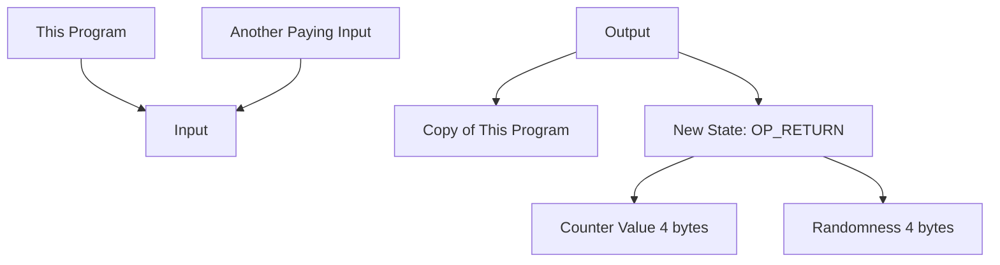

## covenants-examples

This repository includes some examples of [covenants](https://cointelegraph.com/explained/what-are-bitcoin-covenants-and-how-do-they-work) 
using the Rust crates available in the [Bitcoin Wildlife Sanctuary](https://github.com/Bitcoin-Wildlife-Sanctuary) organization.  

Currently, it contains one example: counter. It implements a monotonic counter that can only be increased by 1 each time. 
Specifically, it only supports two operations:
- **Create a new counter:** one can create a new counter with an arbitrarily chosen initial counter value.
- **Increment the counter by 1:** each transaction can only spend the UTXO that represents the previous program and 
generates the new program that is carrying the new counter, which increases by 1.


### Caboose: the data carrier


### Transaction flow

```
// structure:
//
// input:
//   this program
//   another paying input
//
// output:
//   this program (copy)
//   new state: OP_RETURN (4 bytes for the counter value) (4 bytes for randomness)
```

