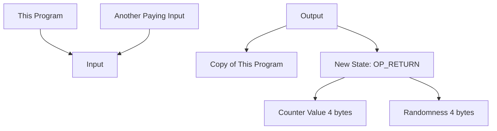

## covenants-examples
Some examples of covenants


### Caboose: a data carrying output


### Transaction flow

```
// structure:
//
// input:
//   this program
//   another paying input
//
// output:
//   this program (copy)
//   new state: OP_RETURN (4 bytes for the counter value) (4 bytes for randomness)
```

