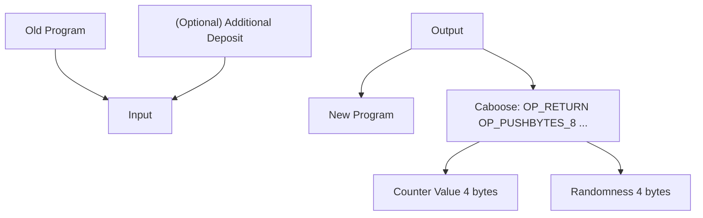

## covenants-examples

This repository includes some examples of [covenants](https://cointelegraph.com/explained/what-are-bitcoin-covenants-and-how-do-they-work) 
using the Rust crates available in the [Bitcoin Wildlife Sanctuary](https://github.com/Bitcoin-Wildlife-Sanctuary) organization.  

Currently, it contains one example: counter. It implements a monotonic counter that can only be increased by 1 each time. 
Specifically, it only supports two operations:
- **Create a new counter:** one can create a new counter with an arbitrarily chosen initial counter value.
- **Increment the counter by 1:** each transaction can only spend the UTXO that represents the previous program and 
generates the new program that is carrying the new counter, which increases by 1.

We have experimented this design on Bitcoin signet. See [SIGNET.md](src/counter/SIGNET.md) for a full walkthrough and 
how to reproduce it. We want to thank Taproot Wizards for the help with this demo. 

### Transaction flow

Each of the transactions in this covenant system has the following layout:

- TxIn:
  * old program, which is a P2TR of the counter update script
  * (optional) a deposit input, which deposits more money into the program for spending
- TxOut:
  * new program, which has the same P2TR address as the old program
  * caboose, described below, which carries the counter



### Caboose: the state-carrying UTXO via P2WSH

The state is carried in an adjacent UTXO next to the new program. This is a pay-to-witness-script-hash (P2WSH) UTXO with 
the following script.

```
OP_RETURN OP_PUSHBYTES_8 [4 bytes of counter value] [4 bytes of the randomizer] 
```

The reason that we use P2WSH rather than P2TR is that the P2TR taproot is a point on the secp256k1 curve that cannot be 
easier "tweaked" inside Bitcoin script. However, P2WSH is just a tagged hash using OP_SHA256. When the new program is 
being executed, it reflects on its own outpoint txid and obtains this adjacent UTXO. It can read data from the previous 
state.

This technique was discussed in a blog article that L2 Iterative contributed to its portfolio company Polyhedra. 
- https://hackmd.io/@polyhedra/bitcoin
- https://hackmd.io/@l2iterative/bitcoin-polyhedra

It is also discussed in the [CatVM book](https://catvm.org/catvm.pdf) in Rijndael's jorurnal. 

A more high-level idea, which is to use txid reflection to look up the previous transaction, was used by Rijndael from 
Taproot Wizards in their implementation of vaults called [purrfect-vault](https://github.com/taproot-wizards/purrfect_vault). 
This was discussed in [Rijndael's talk](https://x.com/fede_intern/status/1787191430110151060) in Bitcoin++ Austin 2024.

Carter Feldman from [QED](https://qedprotocol.com/) implemented a way to split arbitrary large Bitcoin script into covenant 
chunks based on the idea in the blog article above, by hashing the stack and sharing the stack hash across adjacent UTXOs. 
Carter jokingly called it "pay-to-weikeng-hash" in a [tweet](https://twitter.com/cmpeq/status/1788754249037578594). 

Since then, a number of people have been suggesting a formal name for this, and "caboose" stands out as a candidate.
Caboose refers to a railroad car coupled at the **end** of a freight train as a shelter and working space for the crew (see 
[Wikipedia](https://en.wikipedia.org/wiki/Caboose)). 

<p align="center">
  
</p>

Caboose resonates well with the design because the state-carrying UTXO happens to be the last output, so it is also at the 
rear of the "freight train"---the transaction. This is, however, a candidate name for now, and it is very possible that 
people will end up calling it P2WSH trick. 

### Limitations

The counter example does not always require a deposit input (and therefore it is optional). That is, as long as the latest
program has enough sats, one without any Bitcoin can increment the counter using the sats in the program for fees paying to 
the miner. This is convenient especially for testing. The design is also permissionless, in that anyone can increment this counter.

There is, however, a "bug" in this design, in that a miner who wants to earn more fees can "front-run" and replace 
the new transaction with a transaction of its own that performs the same functionality---increasing the counter by 1---
with the difference that it drains all the sats in the program as fees. 

This is not a hard limitation. Indeed, there are many ways to fix this "bug" while keeping it permissionless. We keep the 
current implementation as it is since it is the most general-purpose and educational format. 
- Limit the amount of fees payable to the miner. This can be done by hardcoding a limit in the code and enforcing this limit.
- Rely purely on the deposit input to pay for the fee. This can be done by requiring the program, similar to 
the caboose, to have a small balance (aka, the dust amount, as a balance of zero tends to be rejected) , but the deposit 
input would only be able to be spent "as a whole". A more fine-grained design would enable refunding the remainder back 
to the deposit input's owner (aka the signature public key).
- Keep only a small amount of sats in the program.

Another limitation is that the counter will no longer work if it exceeds the maximum of a signed 32-bit integer in Bitcoin 
script. Since this example is for illustrative purposes, we think it is okay. 

Nevertheless, we think the discussion of limitations is still useful since one needs to realize that Bitcoin script has 
many corner cases that just need a comprehensive code review, and limitations need to be documented properly.

### How it works?

The counter example leverages two wizards in the [Bitcoin-Wildlife-Sanctuary/covenants-gadgets](https://github.com/Bitcoin-Wildlife-Sanctuary/covenants-gadgets/) 
repository. 
- One uses the Schnorr trick to reflect on the current transaction. This is the popular [CAT and Schnorr](https://blog.blockstream.com/cat-and-schnorr-tricks-i/) 
trick from Andrew Poelstra.
- One uses the txid from the TxIn OutPoint to reflect on the previous transaction. This is similar to the vault design from 
Taproot Wizards.

### Acknowledgment

A portion of the code is contributed by [L2 Iterative (L2IV)](https://www.l2iterative.com/), a crypto 
VC based in San Francisco and Hong Kong. The work receives support from Starkware, who is a limited partner in L2IV. For 
disclosure, L2IV has also invested into numerous companies active in the Bitcoin ecosystem, but this work is open-source 
and nonprofit, and is not intended for competition. The code is not investment advice.

Routing a transaction with OP_CAT through the signet before most of the relay nodes are upgraded to the latest version can 
be difficult. We want to thank Taproot Wizards, particularly Rijndael and Udi, for setting up a relay node that will work 
to get the transaction included. More information can be found in [SIGNET.md](src/counter/SIGNET.md).

There are also community members contributing to the code and contributing to the ideas. Bitcoin Wildlife Sanctuary is a 
public-good project supported by many people. 

Below we reiterate the contributors to this repository.

<!-- ALL-CONTRIBUTORS-LIST:START - Do not remove or modify this section -->
<!-- prettier-ignore-start -->
<!-- markdownlint-disable -->
<table>
  <tbody>
    <tr>
      <td align="center" valign="top" width="14.28%"><a href="http://nextdoorhacker.com"><br /><sub><b>Prasanna Gautam</b></sub></a><br /><a href="#code-prasincs" title="Code">💻</a></td>
    </tr>
  </tbody>
</table>

<!-- markdownlint-restore -->
<!-- prettier-ignore-end -->

<!-- ALL-CONTRIBUTORS-LIST:END -->
